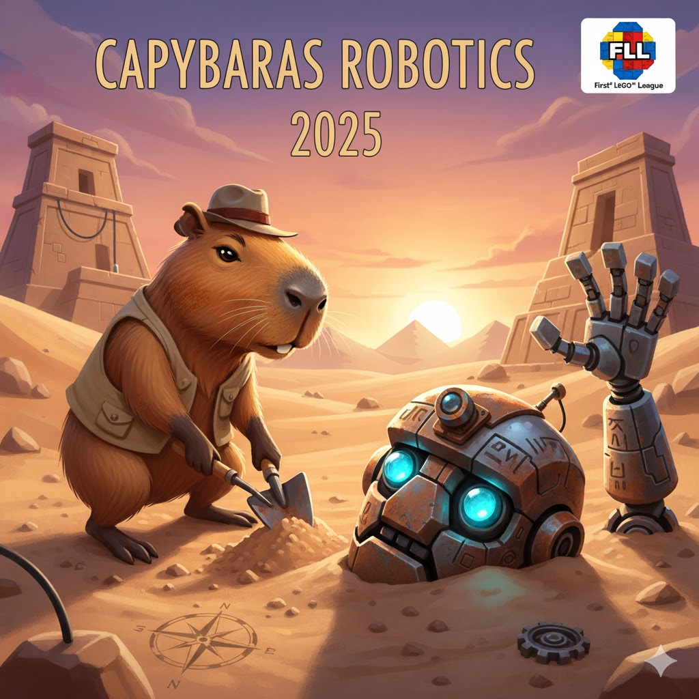

# Capybaras 2025 FLL Challenge - Unearthed

Welcome to the Capybaras 2025 FLL Challenge - Unearthed repository! This project is dedicated to our participation in the FIRST LEGO League (FLL) 2025 challenge, where we explore innovative solutions to real-world problems through robotics and teamwork.

## About the Challenge

The 2025 FLL Challenge, titled "Unearthed," focuses on the theme of earth sciences and sustainability. Teams are tasked with designing, building, and programming LEGO robots to complete various missions related to environmental conservation, resource management, and scientific exploration.

## Our Team

We are the Capybaras, a passionate group of young innovators committed to making a positive impact through STEM education. Our team consists of members with diverse skills in robotics, programming, research, and project management.

## Project Overview

In this repository, you will find all the resources related to our FLL 2025 challenge, including:

- Robot designs and building instructions
- Programming code and algorithms
- Research documentation and presentations
- Team meeting notes and project plans
- Photos and videos of our journey

## Getting Started

Please use the `main.py` file in the root of the project to load the instructions and get started with running our robot simulations and code examples.

Use https://gears.aposteriori.com.sg/ to load the Python file and simulate the robot.
